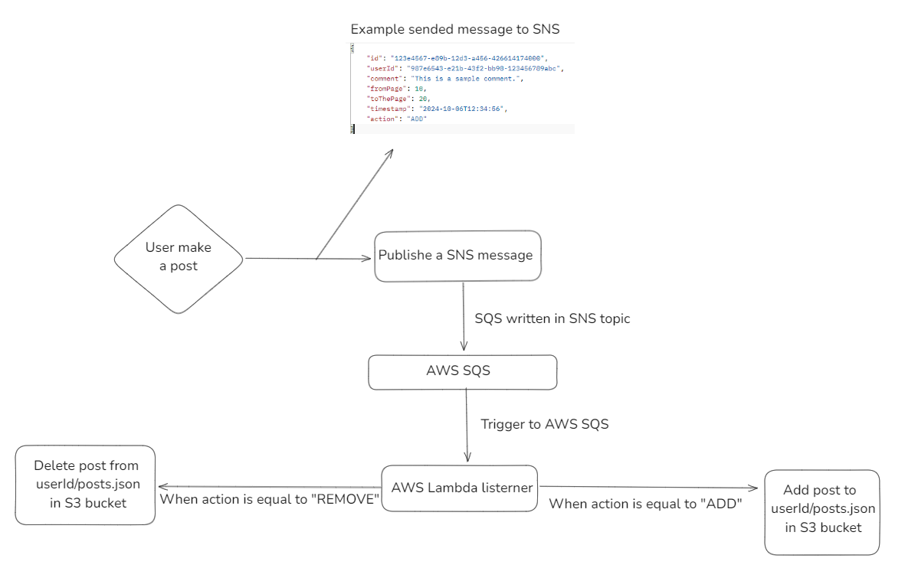

<h1 align="center">
  Book Diary API System
</h1>

## Project

REST API developed to register authors, publishers, books, bookshelves and make comments and reviews about books.

## Diagrams
<details>
    <summary>UML Diagram</summary>
    
</details>
<details>
    <summary>AWS Flow Diagram</summary>
    
</details>

## API Flow

1. **Register Resources**: Admin can register authors, publishers, bookshelves and books.
2. **Bookshelves Associated**: Admin can register a new bookshelf of a category to have books associated with it.
3. **Find Resources**: Users can search all authors, publishers, bookshelves and books for viewing.
4. **Make Posts**: Users can make various comments and reviews about books.
5. **Find Posts**: Users can search all their created posts and search all posts associated with books.
6. **Delete Posts**: Users can delete previously made posts.

## Swagger
**Swagger URL**: http://localhost:8080/swagger-ui/index.html

## Technologies
- Language: Java
- Framework: Spring Boot (Web, Jpa, Security)
- Database: MySQL
- Maven
- Docker
- Node.js 20.x
- AWS Lambda, SQS, SNS, S3 and CloudWatch
- Java JWT
- JUnit 5
- Mockito
- 
## AWS Lambda
<details>
    <summary>AWS Lambda function Node.js 20.x</summary>

    ```javascript
    import { S3Client, GetObjectCommand, PutObjectCommand } from "@aws-sdk/client-s3";

    const client = new S3Client({ region: "us-east-1" });
    const bucketName = process.env.BUCKET_NAME;

    export const handler = async (event) => {
        for (const record of event.Records) {
            const message = JSON.parse(record.body);
            const post = JSON.parse(message.Message);
            const action = post.action;
            const userId = post.user_id;

            const s3FileKey = `users/${userId}/posts.json`;

            if (action === 'ADD') {
                await addPostToS3(s3FileKey, post);
            } else if (action === 'REMOVE') {
                await removePostFromS3(s3FileKey, post.id);
            }
        }
    };

    const addPostToS3 = async (fileKey, post) => {
        try {
            const response = await getS3Object(bucketName, fileKey);

            const existingPosts = JSON.parse(response);

            existingPosts.push(post);

            await putS3Object(bucketName, fileKey, JSON.stringify(existingPosts, null, 2));


        } catch (error) {
            if (error.Code === 'NoSuchKey') {
                await putS3Object(bucketName, fileKey, JSON.stringify([post], null, 2));
            } else {
                console.error('Error getting or putting object in S3:', error);
                throw error;
            }
        }
    };

    const removePostFromS3 = async (fileKey, postId) => {
        try {
            const response = await getS3Object(bucketName, fileKey);
            
            const existingPosts = JSON.parse(response);
            
            const updatedPosts = existingPosts.filter(post => post.id !== postId);
            
            await putS3Object(bucketName, fileKey, JSON.stringify(updatedPosts, null, 2));

        } catch (error) {
            if (error.code === 'NoSuchKey') {
                console.log("File not found. No action taken.");
            } else {
                console.error('Error getting object from S3:', error);
                throw error;
            }
        }
    };

    async function putS3Object(bucket, key, content) {
        try {
            const putCommand = new PutObjectCommand({
                Bucket: bucket,
                Key: key,
                Body: content,
                ContentType: "application/json"
            });

            const putResult = await client.send(putCommand);

            return putResult;

        } catch (error) {
            console.log("Error", error);
            return;
        }
    }

    async function getS3Object(bucket, key) {
        const getCommand = new GetObjectCommand({
            Bucket: bucket,
            Key: key
        });

        try {
            const response = await client.send(getCommand);
            return streamToString(response.Body);

        } catch (error) {
            console.error("Error while getting object from bucket:", error);
            throw error;
        }
    }

    function streamToString(stream) {
        return new Promise((resolve, reject) => {
            const chunks = [];
            stream.on("data", (chunk) => chunks.push(chunk));
            stream.on("end", () => resolve(Buffer.concat(chunks).toString("utf-8")));
            stream.on("error", reject);
        });
    }
    ```

</details>

## Configuration and execution

Prerequisite: Java 17, AWS Account, Docker
1. Clone the repository
2. Install **pom.xml** dependencies with Maven
3. Through the terminal, enter the **docker** folder and run the command **docker compose up**
4. With your AWS account create a user or use an existing one to generate an access key and a secret key
5. Set the environment variables with the names AWS_ACCESS_KEY and AWS_SECRET_KEY defined in application.properties
6. In your AWS account, look for your region and set it in the AWS_REGION environment variable
7. Create an SQS queue and a message board using SNS, create the necessary topic for them to connect to, and set the SNS ARN in the AWS_SNS_TOPIC_POST_ARN environment variable
8. Create an S3 bucket to store the posts' JSON
9. Create the lambda using Node.js 20.x and add your SQS queue as a trigger and add the code I left in the lambda section, in the AWS console set the environment variable BUCKET_NAME with the name of your created bucket
10. Execute **Application.java**
11. **If you have any questions about the execution of the project, feel free to send a message and I will certainly help you.😉**

## Author
Vinicius Brito

https://www.linkedin.com/in/vinicius-brito-962212236/
